## Giới thiệu
Ứng dụng ghi chú sửa dụng sử dụng firebase

## **Giao diện**
* [Video demo](https://youtu.be/RSoTU3A0JrE)

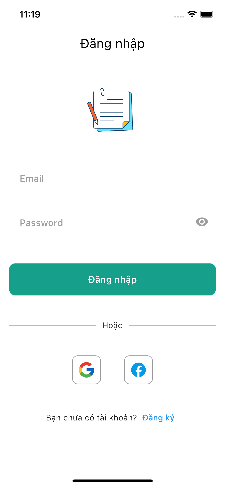</a>
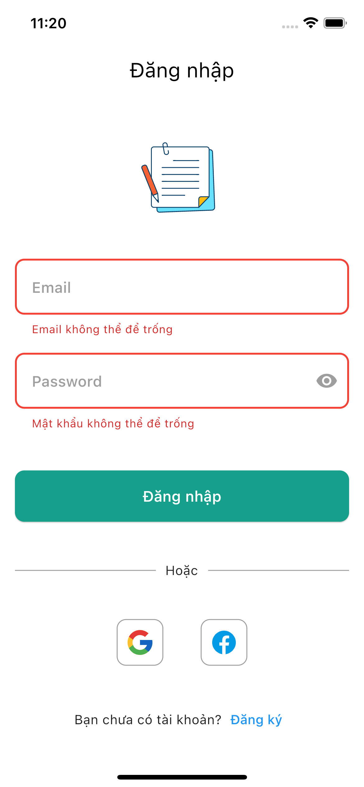</a>
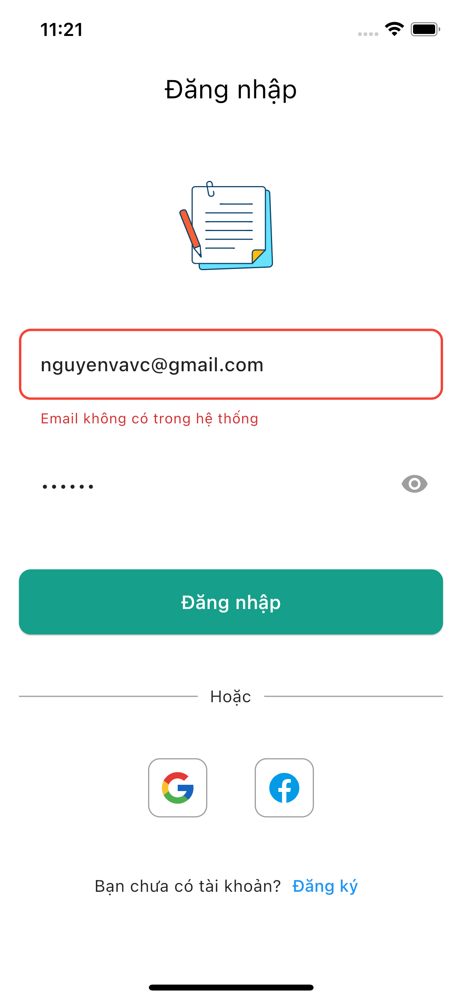</a>
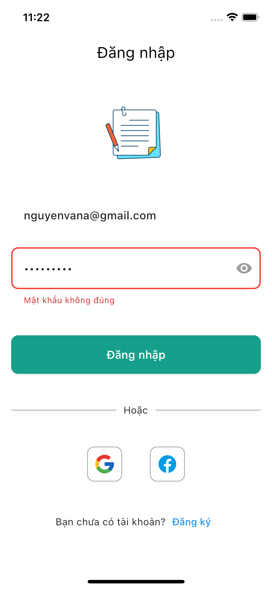</a>
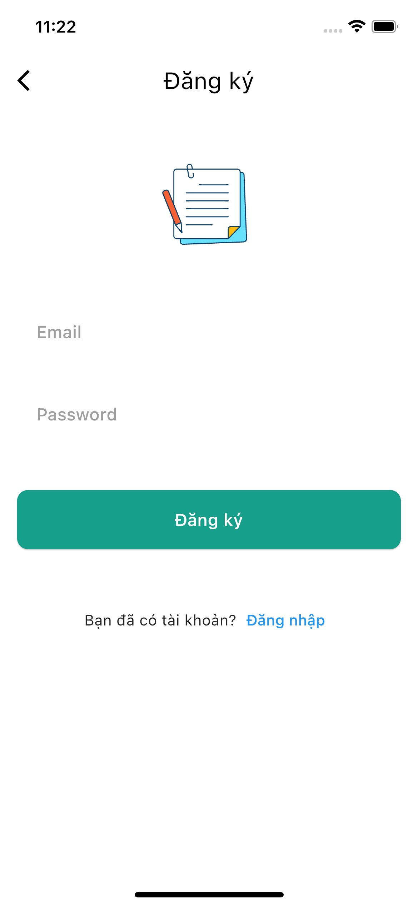</a>
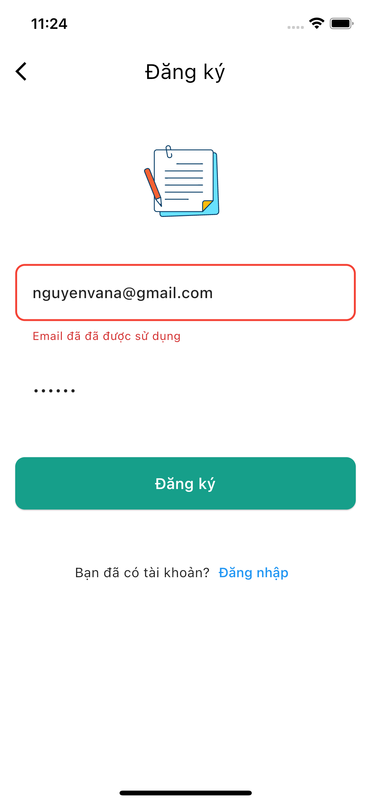</a>
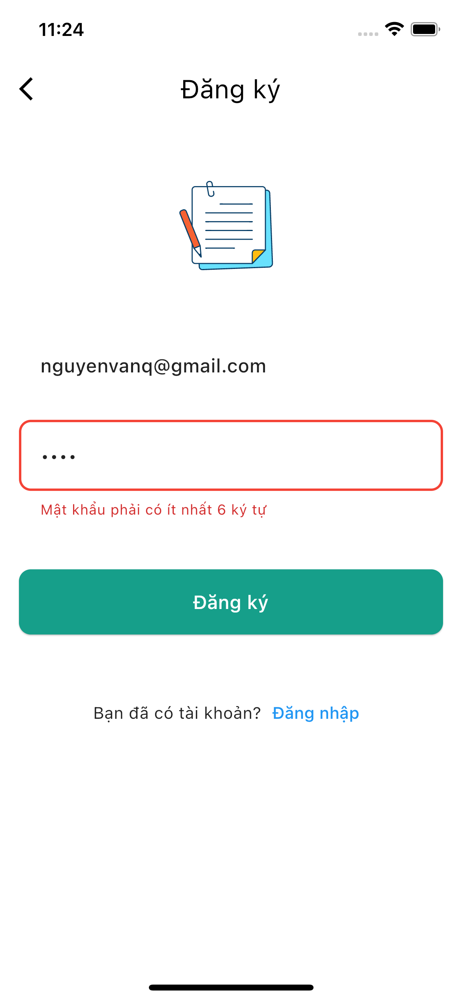</a>
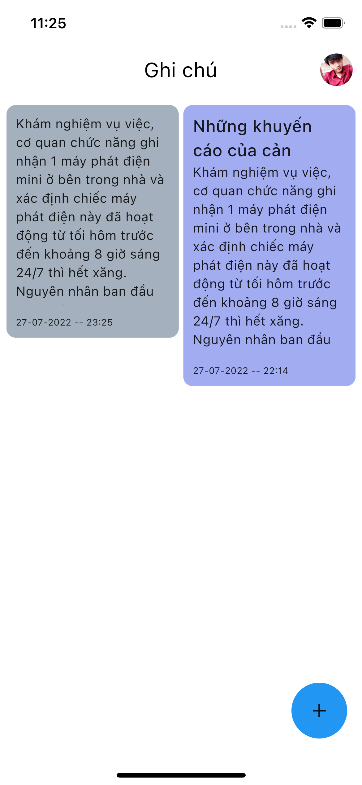</a>
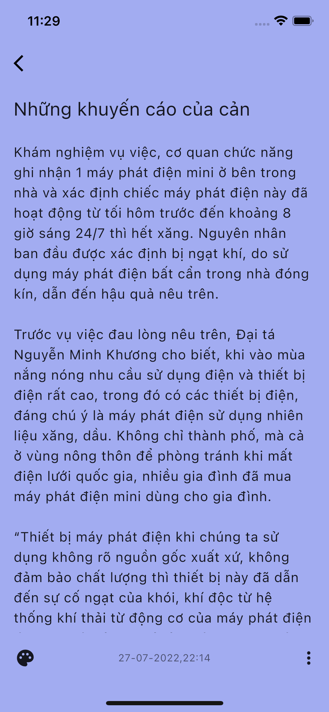</a>
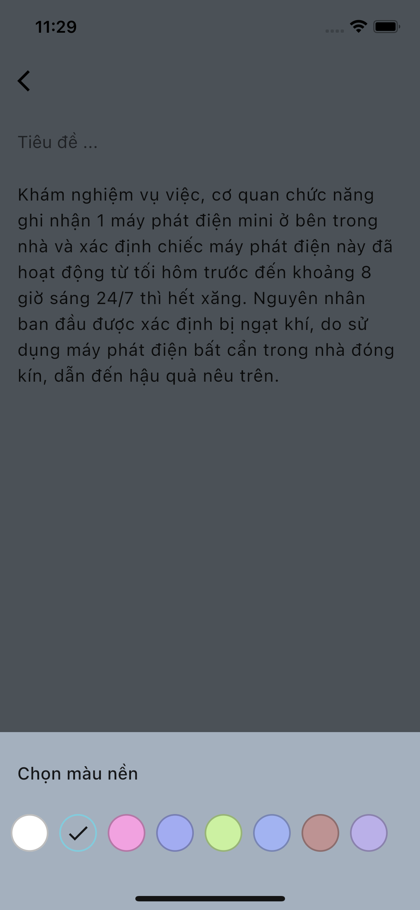</a>
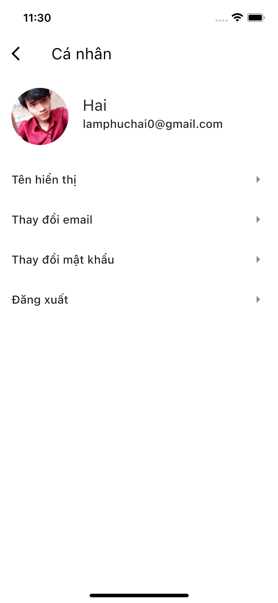</a>

## **Cài đặt**

Clone repository của Note App từ github về máy:	

    $ git clone https://github.com/lamphuchai/note_flutter_app.git

Thiết lập firebase vào project
   [Firebase](https://console.firebase.google.com/)

Chạy lệnh bên dưới bên trong thư mục của project Note app:

    $ flutter pub get

## **Tính năng**

### **Quản lý tài khoản**

* Đăng ký,đăng nhập bằng email/mật khẩu sử dụng FirebaseAuth
* Đăng nhập bằng tài khoản Google
* Đăng xuất
* Đổi mật khẩu
* Thay đổi tên hiển thị
* Thay đổi email

### **Quản lý ghi chú**

* Thêm, sửa, xóa, hiển thị ghi chú.
* Xem thông tin chi tiết ghi chú

## **Thư viện và Công nghệ**
*	[Flutter](https://flutter.dev/)
*	[Firebase](https://firebase.google.com/)
*	[Pub.dev](https://pub.dev/)
*	[Bloc](https://github.com/felangel/bloc)
